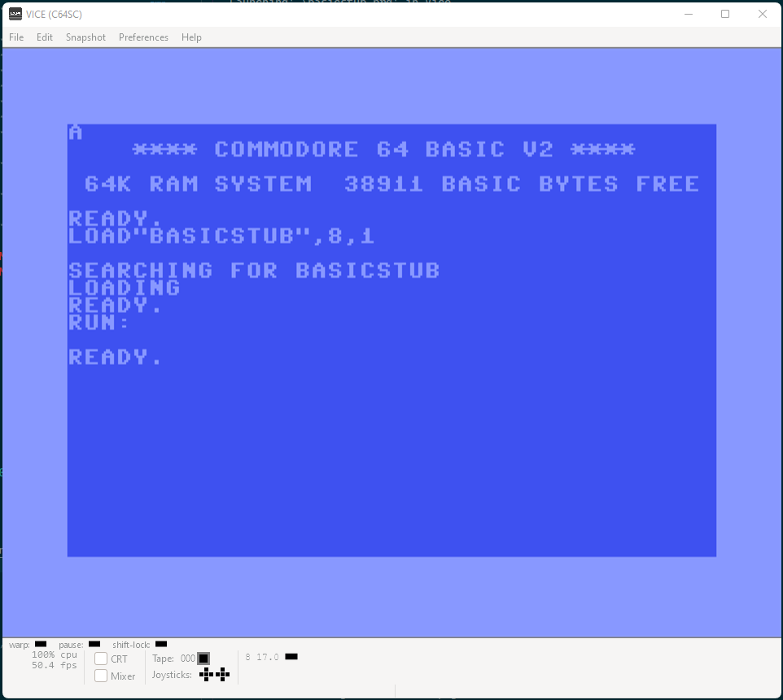

\pagebreak    
    
# Chapter 00 - Prologue

This will be a book about C64 Assembly programming that includes a deep dive into 6502 opcodes, C64 VICII, Basic and Kernal information and how I built a 6502 assembler in PowerShell.

## Revision History
20230624 - First Update

\pagebreak    
    
# Chapter XX - Assembly Routines


## @BASICSTUB()


### Macro Definition
```asm
#MACRO BASICSTUB()
            ; Basic Stub
            ; 10 SYS2061
            DATA        $080B   ; Pointer to Next Line
            DATA        $000A   ; Line Number '10'
            DATA.B      $9E     ; BASIC Token for SYS
            DATA.B      $32     ; '2'
            DATA.B      $30     ; '0'
            DATA.B      $36     ; '6'
            DATA.B      $31     ; '1'  - 2061 is $080D
            DATA.B      $00     ; End of current line
            DATA        $0000   ; Next Line (NULL no more lines)
#ENDM
```


### Assembly Code
```asm
* = $0801

#INCLUDE ..\includes\includes.h

@BASICSTUB()

START:              LDA.#   $01
                    STA     VICII_SCREEN_RAM
                    RTS
```

### Assembly Command
```PowerShell
..\..\source\PSAssembler.ps1 .\basicstub.asm -GenerateLST -ExecutePRG
```

### Output
```asm
08:52:23 : Starting Assembly...
08:52:23 : Loading file '.\basicstub.asm'
08:52:23 : Loading file '.\..\includes\includes.h'
08:52:23 : Loading file '.\..\includes\zeropage.h'
08:52:23 : Loading file '.\..\includes\vicii.h'
08:52:23 : Loading file '.\..\includes\cia.h'
08:52:23 : Loading file '.\..\includes\vicii_macros.h'
08:52:23 : Loading file '.\..\includes\basicstub.h'
08:52:23 : Loading file '.\..\includes\macros.h'
08:52:23 : Executing Code
08:52:23 : Expanding Macros Pass #1
08:52:23 : Expanding Macros Pass #2
08:52:23 : Assembly Pass => Collection
08:52:23 : Assembly Pass => Allocation
08:52:24 : Assembly Pass => Optimization
08:52:24 : Assembly Pass => Relocation
08:52:24 : Assembly Pass => Assembly
08:52:24 : Completed Assembly...
0801 |          |             | * = $0801
0801 |          |             |
0801 |          |             | #INCLUDE ..\includes\includes.h
0801 |          |             |             ; Basic Stub
0801 |          |             |             ; 10 SYS2061
0801 | 0B 08    |             |             DATA        $080B   ; Pointer to Next Line
0803 | 0A 00    |             |             DATA        $000A   ; Line Number '10'  
0805 | 9E       |             |             DATA.B      $9E     ; BASIC Token for SYS
0806 | 32       |             |             DATA.B      $32     ; '2'
0807 | 30       |             |             DATA.B      $30     ; '0'
0808 | 36       |             |             DATA.B      $36     ; '6'
0809 | 31       |             |             DATA.B      $31     ; '1'  - 2061 is $080D
080A | 00       |             |             DATA.B      $00     ; End of current line
080B | 00 00    |             |             DATA        $0000   ; Next Line (NULL no more lines)
080D |          |             | 
080D | A9 01    | LDA #$01    | START:              LDA.#   $01
080F | 8D 00 04 | STA $0400   |                     STA     VICII_SCREEN_RAM        
0812 | 60       | RTS         |                     RTS
Assembly Report:
   Assembly Start  : 6/24/2023 8:52:23 AM
   Assembly End    : 6/24/2023 8:52:24 AM
   Elapsed Seconds : 0.61
   Loaded Lines    : 352
   Loaded Bytes    : 0
   Assembled Lines : 12
   Assembled Bytes : 18
   Total Bytes     : 18
   Starting Address: $0801
   Ending Address  : $0813
   Labels/Variables: 125
   Macros          : 27
   Optimized Out   : 0
08:52:24 : Writing '.\basicstub.prg'
   Wrote to '.\basicstub.prg' in 0.0029457 seconds.
Launching'.\basicstub.prg' in Vice.
```

### Running in Vice
Here is this simplest (well it could be simpler but then there would be no discernable change to C64 to verify that it actually ran some custom assembly) assembly programming running in vice:

{ width=50% }


## Binary to BinaryCodedDecimal

### General Information


### 8 Bit
This example has the #STATS commands to show how the statistics are calculated:

#### Assemblu
```asm
#STATS.PUSH
BINARY_TO_BCD_8:
                LDA.#   0		    ; Clear the Result
		        STA     .RESULT
		        STA     .RESULT + 1
		        SED		            ; Set decimal mode
		        LDX.#   8		    ; The number of source bits
                
#STATS.PUSH
.LOOP:		    ASL     .NUMBER		; Shift out one bit
		        LDA     .RESULT     ; And add into result
		        ADC     .RESULT
		        STA     .RESULT
		        LDA     .RESULT + 1
    	        ADC     .RESULT + 1
		        STA     .RESULT + 1
		        DEX		            ; And repeat for next bit
		        BNE     .LOOP
#STATS.LOOP 8
#STATS.POP
                CLD		            ; Clear decimal mode
                RTS
.NUMBER:		DATA.b  $FF
.RESULT:		PAD     2
#STATS.DETAIL
#STATS.SAVE BINARY_TO_BCD_8
#STATS.POP
```

#### Stats
```
Stat: 'BINARY_TO_BCD_8'
   Bytes: 40   MinCycles: 274   MaxCycles: 290
   MinCycleTime: .27 mSec   MaxCycleTime: .28 mSec
   Max FPS: 3,722.63   Min FPS: 3,517.24
```

### 16 Bit

#### Assembly
```asm
BINARY_TO_BCD_16:       
		        LDA.#   0		; Clear the Result
		        STA     .RESULT
		        STA     .RESULT + 1
                STA     .RESULT + 2
                SED		            ; Set decimal mode
		        LDX.#   16		; The number of source bits

.LOOP:		    ASL     .NUMBER		; Shift out one bit
                ROL     .NUMBER + 1
		        LDA     .RESULT        ; And add into result
		        ADC     .RESULT
		        STA     .RESULT
		        LDA     .RESULT + 1
		        ADC     .RESULT + 1
		        STA     .RESULT + 1
                LDA     .RESULT + 2
		        ADC     .RESULT + 2
		        STA     .RESULT + 2
		        DEX		            ; And repeat for next bit
		        BNE     .LOOP

                CLD		            ; Clear decimal mode
                RTS
.NUMBER:		DATA    $FFFF
.RESULT:		PAD     3
```

#### Stats
```
Stat: 'BINARY_TO_BCD_16'
   Bytes: 57   MinCycles: 790   MaxCycles: 822
   MinCycleTime: .77 mSec   MaxCycleTime: .81 mSec
   Max FPS: 1,291.14   Min FPS: 1,240.88
```

### 24 Bit

#### Assembly
```asm
BINARY_TO_BCD_24:
                LDA.#   0		; Clear the Result
		        STA     .RESULT
		        STA     .RESULT + 1
                STA     .RESULT + 2
                STA     .RESULT + 3
                SED		            ; Set decimal mode
		        LDX.#   24		; The number of source bits

.LOOP:		    ASL     .NUMBER		; Shift out one bit
                ROL     .NUMBER + 1
                ROL     .NUMBER + 2
		        LDA     .RESULT	; And add into result
		        ADC     .RESULT
		        STA     .RESULT
		        LDA     .RESULT + 1	; propagating any carry
		        ADC     .RESULT + 1
		        STA     .RESULT + 1
                LDA     .RESULT + 2	; propagating any carry
		        ADC     .RESULT + 2
		        STA     .RESULT + 2
                LDA     .RESULT + 3	; propagating any carry
		        ADC     .RESULT + 3
		        STA     .RESULT + 3
		        DEX		; And repeat for next bit
		        BNE     .LOOP

                CLD		            ; Clear decimal mode
                RTS
.NUMBER:		DATA    $FFFF
                DATA.b  $FF
.RESULT:	    PAD     4
```

#### Stats
```
Stat: 'BINARY_TO_BCD_24'
   Bytes: 74   MinCycles: 1,562   MaxCycles: 1,610
   MinCycleTime: 1.53 mSec   MaxCycleTime: 1.58 mSec
   Max FPS: 653.01   Min FPS: 633.54
```

### 32 Bit

#### Assembly
```asm
BINARY_TO_BCD_32:
                LDA.#   0		; Ensure the result is clear
		        STA     .RESULT
		        STA     .RESULT + 1
                STA     .RESULT + 2
                STA     .RESULT + 3
                STA     .RESULT + 4
                SED		            ; Set decimal mode
		        LDX.#   32		; The number of source bits

.LOOP:		    ASL     .NUMBER		; Shift out one bit
                ROL     .NUMBER + 1
                ROL     .NUMBER + 2
                ROL     .NUMBER + 3
		        LDA     .RESULT	; And add into result
		        ADC     .RESULT
		        STA     .RESULT
		        LDA     .RESULT + 1	; propagating any carry
		        ADC     .RESULT + 1
		        STA     .RESULT + 1
                LDA     .RESULT + 2	; propagating any carry
		        ADC     .RESULT + 2
		        STA     .RESULT + 2
                LDA     .RESULT + 3	; propagating any carry
		        ADC     .RESULT + 3
		        STA     .RESULT + 3
                LDA     .RESULT + 4	; propagating any carry
		        ADC     .RESULT + 4
		        STA     .RESULT + 4
		        DEX		; And repeat for next bit
		        BNE     .LOOP
		
                CLD		            ; Clear decimal mode
                RTS
.NUMBER:		DATA    $FFFF
                DATA    $FFFF
.RESULT:		PAD     5
```

#### Stats
```
Stat: 'BINARY_TO_BCD_32'
   Bytes: 91   MinCycles: 2,714   MaxCycles: 2,778
   MinCycleTime: 2.66 mSec   MaxCycleTime: 2.72 mSec
   Max FPS: 375.83   Min FPS: 367.17
```

## Example
```asm
START:
                    LDX.#   $10         ; Loop for 16 times...
.LOOP:
                    LDA,X   $1000
                    STA,X   $2000
                    DEX
                    BPL     .LOOP
```

\pagebreak    
    
